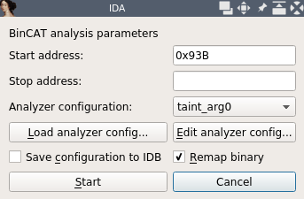
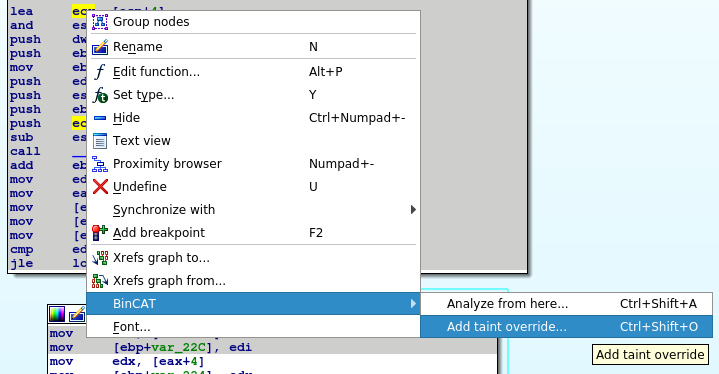
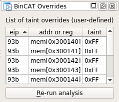

# BinCAT manual

## Table of contents
* [Main commands and features](#main-commands-and-features)
* [IDA Views](#ida-views)

## Main commands and features

### Launch the plugin
* Use the **Edit >> Plugins >> Bincat** menu, or the **Ctrl + Shift + b**
  shortcut

### Start an analysis
In the **IDA View-A** view, go to the instruction you want the analysis to
start from. Then, you can either:
* Use the **Edit >> BinCAT >> Analyze from here** menu
* Use the context menu (right click in **IDA View-A**), then select the
  **BinCAT >> Analyze from here** menu
* Use the **Ctrl + Shift + a** shortcut

* Click **Start** to run the analysis with a new configuration (automatically
  generated)

### Override taint
*Taint* can be overridden for any register value or memory byte, at any
instruction of the program. Overrides will apply at the *next* instruction.

*Taint* overrides can be defined from the following views:
* from the **IDA View-A** view: right click on a register name or memory
  address, then use the **Edit >> BinCAT >> Add taint override...** menu, or
  the contextual menu (right click)

* from the **IDA View-A** view: click on a register name or memory address,
  then use the **Ctrl + Shift + o** shortcut
* from the **BinCAT Tainting** view which shows the registers: right click on
  a register, then choose the **Add taint override** menu

* from the **BinCAT Hex** view which shows the contents of the memory: select
  a memory range, then right click, then choose the **Override taint for
  selection** menu, and input a mask that must be applied to each selected byte

The following values can be used for register overrides:
* **TAINT_ALL** indicates that all register bytes are tainted
* **TAINT_NONE** indicates that no register bytes are tainted
* a binary or hexadecimal taint mask, such as **0x0F** or **0b00001111**, which
  will taint the least significant nibble, and untaint the others

For values stored in memory, binary or hexadecimal taint masks are supported.

Defined taint overrides are then displayed in the **BinCAT Overrides** view.

## IDA Views

### IDA View-A view
On this view, the BinCAT plugin sets the background color for analyzed
instructions:
* Instructions that have been analyzed AND have at least one tainted operand
  have a green background
* Instructions that have been analyzed, but do not manipulate tainted data have
  a gray background

### BinCAT Tainting
This view displays taint and value for each register (general, flags, segment
registers), at a given point in the analysis.

The current RVA is displayed. The instruction that is present at this address
may have been analyzed several times, especially if it is part of a loop. In
that case, the analyzer will have created one "node" for each analysis. This
view allows choosing the node that is currently being viewed.

Register contents are represented:
* Values are represented as text, using both an hexadecimal and an ascii
  representation. The `?` value indicates that at least one bit of the
  represented byte or nibble is set to to abstract value **TOP**, meaning its
  value is unknown
* Taint is represented using colors, for each represented nibble or byte:
  * black means that none of its bits are tainted, with no taint uncertainty
  * green means that all of its bits are tainted, with no taint uncertainty
  * blue means that at least one of the bits is uncertainly tainted
  * yellow is used if there is no taint uncertainty, and some of the bits only
    are tainted
* Type is displayed as a tooltip, shown when the mouse hovers a register, if
  type data is available

### BinCAT Hex view

This view displays the memory contents. BinCAT's representation splits memory
into 3 regions: heap, stack, and global, which can be chosen using a drop-down
menu on this view. Then, a second drop-down menu allow selecting the displayed
address range.

Memory contents are displayed as a grid, using the same conventions are for the **BinCAT Tainting** view described above, regarding value, taint and type.

### BinCAT Overrides

This view lists all user-defined taint overrides, rendered as a grid. Overrides
can be directly modified by editing grid cells. To remove an override, right
click on the override that is to be removed, then choose the **Remove** menu.

This view also features a **Re-run analysis** button, which allows conveniently
re-run the analysis, with updated overrides.

### BinCAT Debugging

This view displays the list of BinCAT intermediate language instruction that
represents the currently selected instruction, as well as the associated bytes. 

BinCAT only outputs intermediate language debugging data if loglevel > 2 in the
analysis parameters. This data is useful for BinCAT developers and debuggers.

### BinCAT Configurations

This view displays the list of BinCAT analysis configurations that were saved by the user. Users may:
* Display or edit configurations: select a configuration, then click the
  **Edit** button
* Export configurations; select a configuration, then click the **Export** button
* Delete configurations: select a configuration, right click, then choose the
  **Remove** menu

### Ida Output Window

This view displays log messages that stem from the BinCAT plugin, or the BinCAT
analyzer.

It also features a python shell, which can be used to debug the BinCAT plugin:
a global variable (`bc_state`) allows accessing its internal objects.

